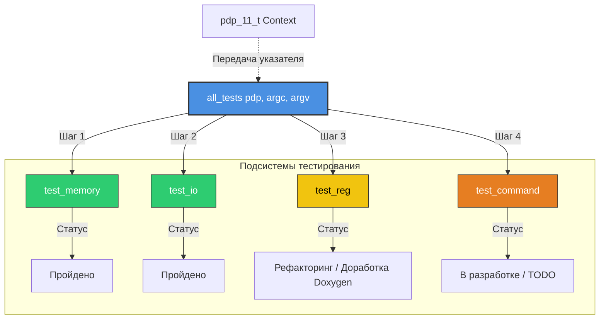

# 🧪 Модульный тестовый фреймворк эмулятора PDP-11

Центральный агрегатор и диспетчер модульного тестирования (`test.c`) для верификации компонентов архитектуры эмулятора PDP-11.

---

## 📌 Обзор компонента

Файл `test.c` выполняет роль единой точки входа для запуска комплексного тестирования эмулятора. Он координирует последовательную проверку всех критически важных узлов системы: оперативной памяти, регистров, инструкций процессора и периферийного ввода-вывода.

### Ключевые функции
* **Централизованный запуск:** Последовательная изоляция и проверка каждого модуля.
* **Гибкая конфигурация:** Поддержка передачи аргументов командной строки для фильтрации тестов.
* **Строгая верификация:** Мгновенное прерывание выполнения при обнаружении ошибок (fail-fast).

---

## 🏗️ Архитектура и связи модулей

Компонент объединяет изолированные тесты различных подсистем эмулятора. Ниже представлена структура зависимостей и порядок выполнения проверок.

---

## 🛠️ Спецификация API

### `void all_tests(struct pdp_11_t *pdp, int argc, char **argv)`

Главный диспетчер тестовой подсистемы.

| Параметр | Тип | Описание |
| :--- | :--- | :--- |
| `pdp` | `struct pdp_11_t *` | Указатель на контекст эмулятора (входной/выходной). |
| `argc` | `int` | Количество аргументов командной строки. |
| `argv` | `char **` | Массив строк аргументов для фильтрации и настройки тестов. |

**Важное примечание:** При падении любого внутреннего теста работа всей программы аварийно завершается (`assert`), гарантируя, что нестабильный код не пойдет дальше.

---

## 📂 Структура подключаемых файлов

Логика тестов распределена по специализированным заголовочным файлам:

* 💾 `tests/test_pdp/test_memory/test_memory.h` — Проверка шины адреса, секторов памяти и лимитов.
* 🔌 `tests/test_pdp/test_io/test_io.h` — Проверка портов ввода-вывода и регистров периферии.
* 🗃️ `tests/test_pdp/test_reg/test_reg.h` — Проверка состояния РОН (R0-R7) и регистра PSW.
* ⚡ `tests/test_pdp/test_command/test_command.h` — Верификация декодирования и исполнения инструкций.

---

## 📋 План доработки (Status & TODO)

- [x] Интеграция тестов оперативной памяти (`test_memory`)
- [x] Интеграция тестов ввода-вывода (`test_io`)
- [ ] Полноценное документирование и покрытие тестов регистров (`test_reg`)
- [ ] Завершение реализации тестов команд процессора (`test_command`)
