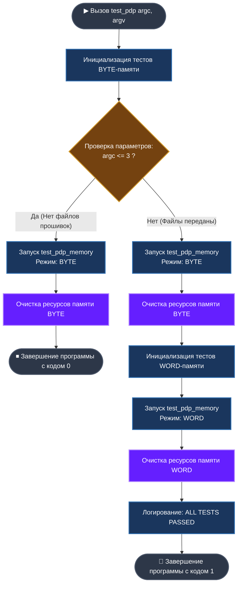

# 🚀 Модуль тестирования эмулятора PDP-11 (`test_pdp.c`)

## 📝 Общее описание
Данный модуль является **главным диспетчером автоматизированного тестирования** эмулятора процессора PDP-11. Он управляет полным жизненным циклом виртуальной машины (выделение ресурсов, инициализация ядра, деструктуризация) и изолированно проверяет поведение системы в двух ключевых режимах работы с памятью:
* 🔹 **BYTE Mode** — режим побайтовой (8-битной) адресации.
* 🔸 **WORD Mode** — режим пословной (16-битной) адресации.

---

## 🗺️ Схема логики работы модуля (Mermaid)

Ниже представлена визуальная схема алгоритма, по которому диспетчер `test_pdp` распределяет потоки тестирования в зависимости от аргументов командной строки (`argc`):



---

## 🛠️ Архитектура и функции модуля

### 1. Конфигурация шины данных
```c
void memory_type(byte_t type_memory);
```
* **Назначение**: Глобальный переключатель физического уровня эмуляции.
* **Принцип работы**: Записывает переданный флаг в `g_default_memory`. Изменяет внутреннюю логику выравнивания адресов и чтения/записи данных.

### 2. Изолированный контейнер теста
```c
void test_pdp_memory(byte_t type_memory, int argc, char **argv);
```
Инкапсулирует безопасный цикл выполнения тестов, гарантирующий отсутствие утечек памяти:
1. **`pdp_new()`** — Аллокация памяти под контекст CPU.
2. **`pdp_create()`** — Конструирование регистров и маппинг адресного пространства.
3. **`assert(pdp)`** — Защита «от дурака» (проверка указателя).
4. **`all_tests()`** — Прогон комплексных тест-кейсов (инструкции, флаги процессора).
5. **`pdp_destroy() + free()`** — Деструктуризация и возврат памяти ОС.

### 3. Диспетчер стратегии
```c
int test_pdp(int argc, char **argv);
```
* **Сокращенный режим**: Если утилите не переданы файлы бинарных прошивок (`argc <= 3`), выполняется быстрая внутренняя проверка базовой логики в режиме `BYTE`. Программа возвращает `0`.
* **Полный режим**: Если аргументы содержат пути к файлам, запускается комплексная матрица тестов (`BYTE` + `WORD`). Программа возвращает `1`.

---

## 📥 Зависимости (Архитектурные слои)

Модуль активно взаимодействует со следующими компонентами проекта:
* `pdp_11/core` — Логика процессора и деструкторы (`pdp_new`, `pdp_destroy`).
* `pdp_11/register` — Низкоуровневое состояние регистров общего назначения (РОН).
* `utils/logger` — Подсистема красочного логирования статусов (`INFO`, `WARNING`, `PRINT_RESULT`).
* `tests/test_command` — Пакет тестов для верификации работы парсера и исполнителя команд.

---


*Вывод в консоль:*
```text
[WARNING] ALLOCAT MEMORY FOR CLASS MEM_BYTE_T < BYTE >
[INFO]    ALLOCAT MEMORY TYPE ==BYTE==
 ... OK
[WARNING] MEMORY TYPE ==BYTE== DESTROY !!!

[WARNING] ALLOCAT MEMORY FOR CLASS MEM_WORD_T < WORD >
[INFO]    ALLOCAT MEMORY TYPE ==WORD== !!!
 ... OK
[WARNING] MEMORY ==WORD== DESTROY !!!

[INFO]    ALL TESTS PDP_11 PASSED SUCCESSFULLY
```
